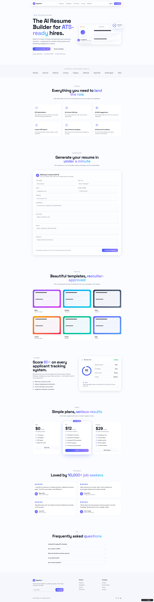

# NextCVAI

NextCVAI is an AI-powered modern resume builder web application designed to help users create professional, ATS-friendly resumes quickly and efficiently.

The platform provides a clean user interface, dynamic resume generation, and modern design customization features for creating industry-standard resumes.

---

# Live Demo

https://nextcvai.lovable.app/

---

# Features

- AI-powered resume generation
- Modern and responsive UI
- ATS-friendly resume layouts
- Dynamic resume customization
- User-friendly form interface
- Real-time preview
- Fast and lightweight application
- Clean modern design
- Mobile responsive interface

---

# Tech Stack

- Next.js
- React.js
- TypeScript
- Tailwind CSS
- Lovable AI

---

# Project Overview

NextCVAI helps users generate professional resumes through a simplified workflow.

Users can:

- Enter personal information
- Add education details
- Add skills and experience
- Generate professional resume layouts
- Preview resumes in real-time
- Create modern ATS-compatible resumes

---

# User Workflow

## 1. Enter User Information

Users provide:

- Personal details
- Contact information
- Skills
- Experience
- Education
- Projects

---

## 2. Resume Generation

The system dynamically generates a professional resume layout based on the provided information.

---

## 3. Real-Time Preview

Users can preview resume updates instantly while editing.

---

## 4. Responsive Design

The application works smoothly across:

- Desktop
- Tablet
- Mobile devices

---

# UI Highlights

- Clean dashboard design
- Minimal modern interface
- Fast navigation
- Professional typography
- Responsive layout
- Smooth user experience

---

# Future Improvements

- PDF export support
- Multiple resume templates
- AI resume suggestions
- Cover letter generator
- LinkedIn integration
- Resume scoring system
- Dark mode support

---

# Application Preview



## Application Preview

Add project screenshots inside the `screenshots` folder.

Example:

```text
screenshots/
├── home.png
├── resume-builder.png
└── preview.png
```

---

# Installation

## Clone Repository

```bash
git clone YOUR_GITHUB_REPO_LINK
```

---

## Open Project Folder

```bash
cd nextcvai
```

---

## Install Dependencies

```bash
npm install
```

---

## Run Development Server

```bash
npm run dev
```

---

# Build Project

```bash
npm run build
```

---

# Start Production Server

```bash
npm start
```

---

# Repository Structure

```text
nextcvai/
│
├── public/
├── src/
├── screenshots/
├── package.json
└── README.md
```

---

# Author

Radoanul Arifen****
